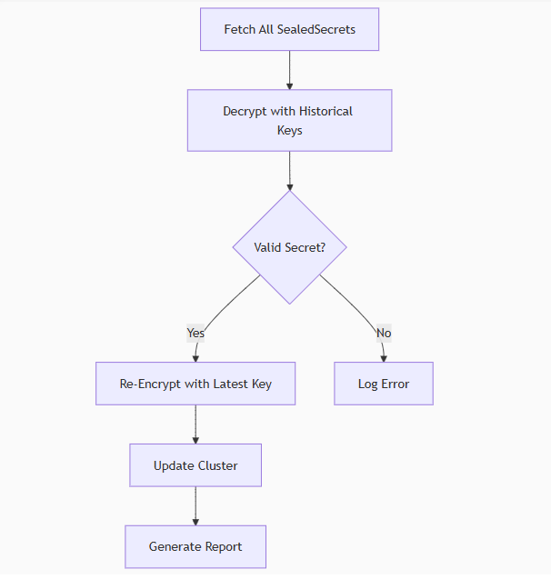

# SealedSecrets Re-Encryption Automation Feature

This feature automates the re-encryption of SealedSecrets in a Kubernetes cluster. It ensures that all SealedSecrets are re-encrypted with the latest encryption keys, enhancing the security of sensitive data.

## Architecture Overview




The SealedSecrets re-encryption automation follows a straightforward process:

1. **Key Management**: The system leverages the SealedSecrets controller's key rotation capabilities to generate new encryption keys.

2. **Discovery**: Using Kubernetes API, the system identifies all SealedSecret resources across all namespaces in the cluster.

3. **Public Key Retrieval**: The latest public key is fetched from the SealedSecrets controller (stored as a labeled Kubernetes Secret).

4. **Decryption Process**: Each SealedSecret is decrypted using existing private keys from the controller.

5. **Re-encryption**: The original secret data is re-encrypted with the new public key.

6. **Cluster Update**: All SealedSecrets in the cluster are updated with their newly encrypted versions through Kubernetes API PATCH operations.

The entire workflow is executed within the cluster by the controller, ensuring that sensitive data never leaves the cluster environment. This architecture maintains the security model of SealedSecrets while providing an automated mechanism to refresh encryption when keys are rotated.

## Usage Documentation

### Command Syntax 

```bash
kubeseal --re-encrypt --all
```

Add `--all` flag to the existing `--re-encrypt`.

### Example Workflow


Re-encrypt all secrets in the cluster with the new key.

```bash
kubeseal --re-encrypt --all
```

## Implementation Strategy

### 1. List All SealedSecrets

We need to list all `SealedSecrets` in the cluster, so that we can process them.

- We can manually get them using the following command:

```bash
kubectl get SealedSecrets --all-namespaces -o json
```

**Plan**: Extend `pkg/client` utilities to programmatically list `SealedSecret` objects. Leverage `client-go`'s dynamic client or generated CRD clients.

### 2. Fetch Public Key

In the controller, we need to fetch the latest public key from the SealedSecrets controller. This is crucial for re-encrypting the secrets with the new key. We will add functionality in the controller to fetch it.

- Controller stores keys as Kubernetes Secrets labeled with `sealedsecrets.bitnami.com/sealed-secrets-key=active`.

- We can manually fetch the public key using the following command:

```bash
kubectl -n kube-system get secrets -l sealedsecrets.bitnami.com/sealed-secrets-key
```

**Plan**: Extend `pkg/crypto` to parse the key from secrets. Add a function in `pkg/crypto/keys.go` to fetch the latest public key from the controller.

### 3. Decrypt SealedSecrets

We need to decrypt the `SealedSecrets` using the latest public key fetched from the controller. This will allow us to access the original secret data.

- The core logic for this is already made in `pkg/controller/controller.go` and used when `SealedSecret` is used to create the `Secret` object.

**Plan**: We may just need to extract the logic and make it reusable.

### 4. Re-encrypt SealedSecrets

We need to re-encrypt the `SealedSecrets` using the new public key. This will ensure that all secrets are encrypted with the latest key.

- Encryption was usually made from the Client (`kubeseal`) and not from the Controller. Encryption logic in `cmd/kubeseal` and `pkg/crypto/hybrid.go`.

**Plan**: We will reuse this logic.

### 5. Update SealedSecrets in the Cluster

We need to replace all the `SealedSecrets` in the cluster with the newly encrypted secrets. This will ensure that all secrets are up-to-date with the latest encryption.

- We can use the `kubectl` command to update the secrets in the cluster manually

- We will use Kubernetes API PATCH operations to update the secrets programmatically.

- To prevent race conditions, we can use `resourceVersion` checks during updates.

**Plan**: Use the Kubernetes `client-go` library to update the `SealedSecrets` in the cluster. We will use the `Update` method to replace the existing secrets with the newly encrypted ones.

## Bonus

### 1. Logging

- Project already uses `klog` for controller logging

**Plan**: Add dedicated logger for re-encryption workflow

### 2. Efficiency and Performance
- Process secrets in parallel to speed up the re-encryption process.
- Stream secrets instead of loading them all into memory at once.

**Plan**: Keep these in mind when implementing.

### 3. Security

- The whole workflow is run internally in the cluster by the controller. No secrets are sent to the client.

### 4. Testing

**Plan**: Integration tests for the entire workflow in `integration` folder.

### 5. Documentation

**Plan**: Update the README with usage instructions and examples.

### 6. Git Integration

- Now that we change the `SealedSecret` object, we should add a way to automatically commit to and update git repositories with the new secrets.

- There is no code done for this in the project.
